# Rapport — Classification de l'endométriose

**Projet :** Prédiction du diagnostic d'endométriose à partir de variables cliniques
**Dataset :** [Endometriosis Dataset (Kaggle)](https://www.kaggle.com/datasets/michaelanietie/endometriosis-dataset) — 10 000 observations synthétiques
**Date :** 2026-04-16

---

## Résumé exécutif

Ce rapport présente une analyse exploratoire et une comparaison de 5 modèles de classification sur un jeu de données synthétique de 10 000 patientes, destiné à prédire la présence d'endométriose à partir de 6 variables cliniques (âge, BMI, douleur chronique, irrégularité menstruelle, anomalie hormonale, infertilité).

**Principaux résultats :**
- Données propres, sans valeurs manquantes ni doublons.
- Classes modérément déséquilibrées : 59 % de cas négatifs, 41 % de cas positifs.
- Les variables les plus discriminantes sont l'**anomalie hormonale** (r = 0,19) et le **niveau de douleur chronique** (r = 0,12). Les autres variables présentent une corrélation faible avec la cible.
- Le **SVM (noyau RBF)** obtient le meilleur F1-score sur le test set (**0,577**), suivi de près par la **Logistic Regression** (0,574).
- Les performances globales restent modestes (accuracy ≈ 0,61, ROC-AUC ≈ 0,66), ce qui suggère que le signal présent dans les variables disponibles est limité — cohérent avec un dataset synthétique généré avec une composante aléatoire significative.

---

## 1. Contexte et objectifs

L'endométriose est une maladie gynécologique chronique qui touche environ une femme sur dix en âge de procréer. Son diagnostic est souvent tardif (plusieurs années en moyenne), ce qui motive le développement d'outils d'aide au dépistage basés sur les symptômes rapportés.

**Objectifs du projet :**
1. Explorer les distributions et corrélations du dataset.
2. Entraîner et comparer plusieurs modèles de classification supervisée.
3. Identifier les variables les plus informatives.

---

## 2. Présentation du dataset

### 2.1 Variables

| Variable | Type | Plage / Modalités | Description |
|---|---|---|---|
| `Age` | entier | 18–49 | Âge de la patiente |
| `Menstrual_Irregularity` | binaire | 0 / 1 | Irrégularité menstruelle |
| `Chronic_Pain_Level` | continu | 0–10 | Niveau de douleur chronique auto-reporté |
| `Hormone_Level_Abnormality` | binaire | 0 / 1 | Anomalie détectée des niveaux hormonaux |
| `Infertility` | binaire | 0 / 1 | Infertilité signalée |
| `BMI` | continu | 15–37 | Indice de masse corporelle |
| `Diagnosis` | binaire | 0 / 1 | **Cible** — endométriose (0 = non, 1 = oui) |

### 2.2 Statistiques descriptives

- 10 000 observations, 7 variables
- Aucune valeur manquante, aucun doublon
- Âge moyen : 33,7 ans (écart-type 9,2)
- BMI moyen : 23,1 (écart-type 3,9)
- 70 % des patientes présentent une irrégularité menstruelle, 57 % une anomalie hormonale, 30 % une infertilité

---

## 3. Analyse exploratoire

### 3.1 Distribution de la variable cible

La variable cible est modérément déséquilibrée : **59,2 %** de patientes non diagnostiquées contre **40,8 %** diagnostiquées. Ce déséquilibre est pris en compte via un split stratifié et l'option `class_weight='balanced'`.

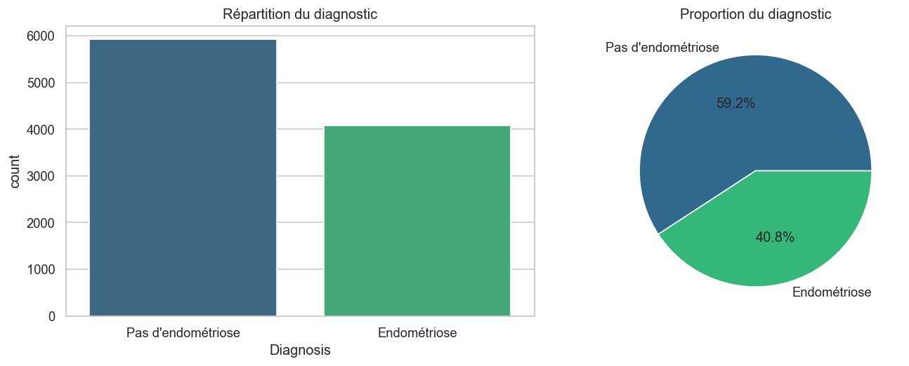

### 3.2 Variables numériques

Les distributions des variables `Age`, `Chronic_Pain_Level` et `BMI` sont approximativement uniformes ou normales sur leurs plages respectives.

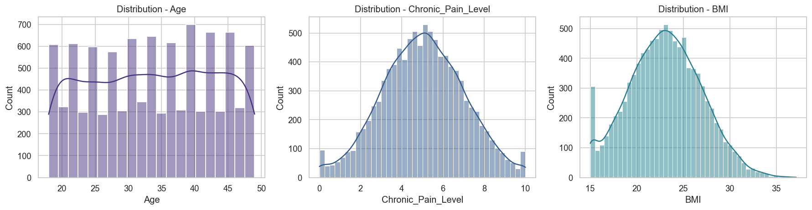

Une analyse bivariée par diagnostic révèle un décalage faible mais présent pour la douleur chronique : la médiane passe de 4,85 chez les cas négatifs à 5,24 chez les cas positifs.

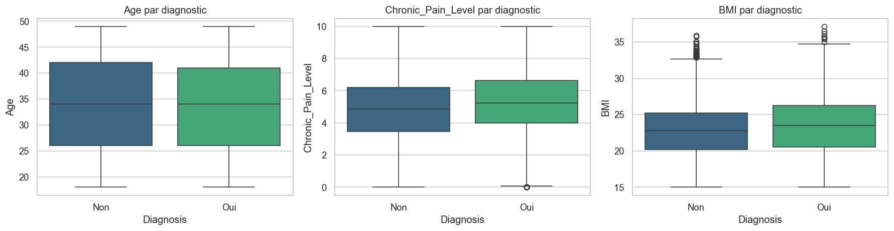

### 3.3 Variables binaires

Toutes les variables binaires présentent une prévalence plus élevée chez les cas positifs :

| Variable | % positif si Diagnosis=0 | % positif si Diagnosis=1 | Écart |
|---|---|---|---|
| Menstrual_Irregularity | 66,1 % | 75,0 % | +8,9 pts |
| Hormone_Level_Abnormality | 51,5 % | 70,2 % | +18,7 pts |
| Infertility | 26,2 % | 35,1 % | +8,9 pts |

L'anomalie hormonale est la variable binaire la plus discriminante.

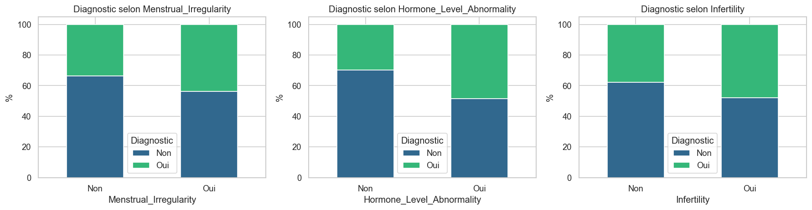

### 3.4 Matrice de corrélation

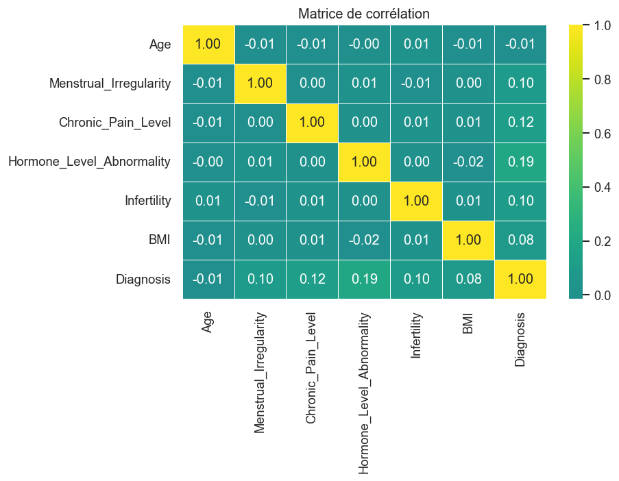

Les corrélations entre variables explicatives sont très faibles (< 0,02), ce qui suggère l'absence de multicolinéarité problématique.

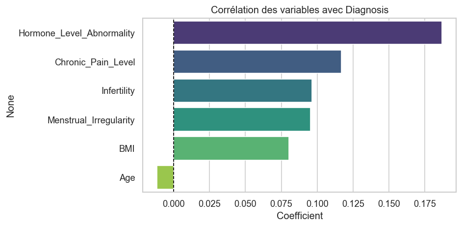

**Classement des variables par corrélation avec `Diagnosis` :**

| Variable | Corrélation (Pearson) |
|---|---|
| Hormone_Level_Abnormality | 0,187 |
| Chronic_Pain_Level | 0,117 |
| Infertility | 0,096 |
| Menstrual_Irregularity | 0,095 |
| BMI | 0,080 |
| Age | −0,012 |

L'âge ne présente quasiment aucun pouvoir prédictif linéaire dans ce dataset — ce qui est inattendu cliniquement, mais cohérent avec la nature synthétique des données.

---

## 4. Modélisation

### 4.1 Protocole

- **Split** : 80 % entraînement / 20 % test, stratifié sur `Diagnosis`, `random_state=42`
- **Prétraitement** : `StandardScaler` dans tous les pipelines
- **Validation** : Stratified K-Fold 5-plis sur le F1-score (jeu d'entraînement)
- **Évaluation finale** : sur le test set avec Accuracy, Precision, Recall, F1 et ROC-AUC
- **Déséquilibre** : `class_weight='balanced'` pour LogReg, SVM et Random Forest

### 4.2 Modèles comparés

| # | Modèle | Hyperparamètres clés |
|---|---|---|
| 1 | Logistic Regression | `max_iter=1000`, `class_weight='balanced'` |
| 2 | K-Nearest Neighbors | `n_neighbors=7` |
| 3 | Support Vector Machine | kernel=RBF, `class_weight='balanced'`, `probability=True` |
| 4 | Random Forest | `n_estimators=200`, `class_weight='balanced'` |
| 5 | Gradient Boosting | `n_estimators=200` |

### 4.3 Validation croisée (5-fold)

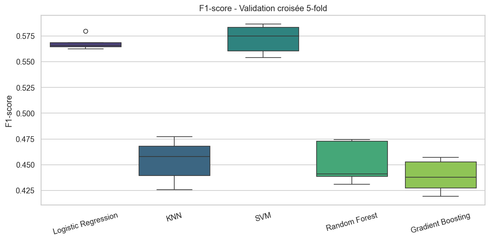

La dispersion des scores reste faible d'un pli à l'autre, ce qui indique des modèles stables.

### 4.4 Résultats sur le test set

| Modèle | Accuracy | Precision | Recall | **F1** | ROC-AUC |
|---|---|---|---|---|---|
| Logistic Regression | 0,6095 | 0,5172 | 0,6434 | 0,5735 | **0,6575** |
| KNN | 0,5945 | 0,5035 | 0,4363 | 0,4675 | 0,6003 |
| SVM | 0,6075 | 0,5149 | 0,6569 | **0,5773** | 0,6422 |
| Random Forest | 0,6030 | 0,5159 | 0,4375 | 0,4735 | 0,6032 |
| Gradient Boosting | **0,6195** | **0,5518** | 0,3591 | 0,4350 | 0,6380 |

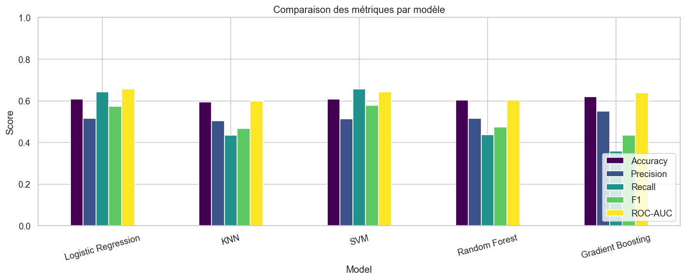

**Lecture :**
- **SVM** obtient le meilleur F1 grâce à un excellent rappel (65,7 %).
- **Logistic Regression** est très proche sur F1 (0,574) et meilleur sur ROC-AUC (0,658) — un bon compromis performance / interprétabilité.
- **Gradient Boosting** a la meilleure accuracy, mais un rappel faible (36 %) : il manque beaucoup de cas positifs.
- **KNN** et **Random Forest** sont en retrait, avec des rappels faibles.

### 4.5 Courbes ROC

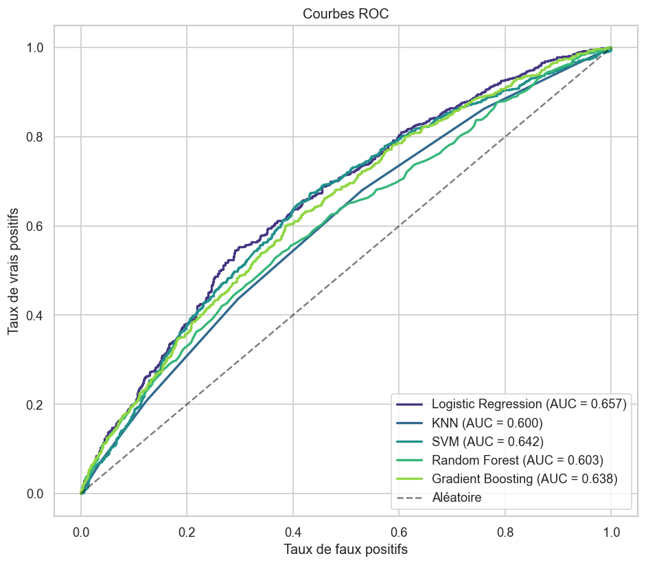

La hiérarchie des AUC confirme la robustesse de la Logistic Regression comme modèle de référence.

### 4.6 Matrices de confusion

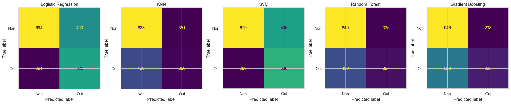

Les modèles équilibrés (LogReg, SVM) répartissent mieux les erreurs. Les modèles non équilibrés (GB, KNN, RF) sont biaisés vers la classe majoritaire, ce qui réduit la détection des cas positifs.

### 4.7 Importance des variables

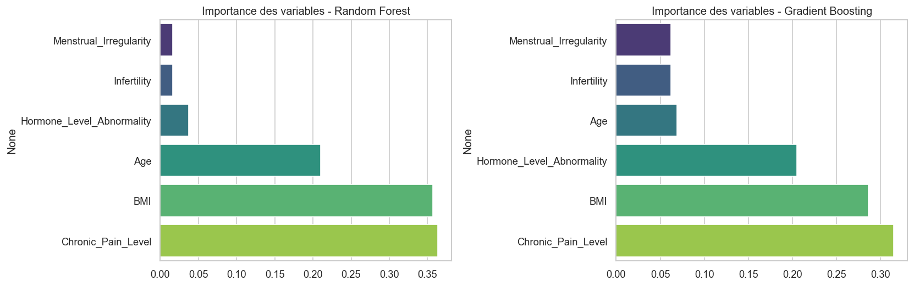

Les deux modèles tree-based confirment l'importance de **Hormone_Level_Abnormality** et **Chronic_Pain_Level**. L'âge et le BMI contribuent également (bien que faiblement corrélés linéairement), ce qui suggère une information capturée via des interactions non linéaires.

---

## 5. Discussion

### 5.1 Pourquoi des performances modérées ?

Les scores plafonnent autour de 0,58 de F1 et 0,66 de ROC-AUC. Plusieurs raisons :

1. **Nature synthétique du dataset** : la relation entre variables et cible inclut une part significative de bruit aléatoire.
2. **Faible nombre de variables** (6 features) : peu de signal disponible.
3. **Corrélations linéaires faibles** : même la variable la plus corrélée (hormones) reste à r = 0,19.
4. **Absence de variables cliniques importantes** : antécédents familiaux, type de douleur, résultats d'imagerie, etc., ne sont pas dans le dataset.

### 5.2 Choix du modèle selon le contexte

| Objectif | Modèle recommandé |
|---|---|
| Maximiser le rappel (dépistage, ne rater aucun cas) | **SVM** ou **Logistic Regression** |
| Interprétabilité (coefficients cliniquement lisibles) | **Logistic Regression** |
| Meilleur compromis global | **Logistic Regression** (F1 ≈ SVM, AUC supérieur, explicable) |

Dans un contexte médical de dépistage, un **rappel élevé** est crucial : un faux négatif (patiente malade classée saine) est plus coûteux qu'un faux positif. La **Logistic Regression** combine cet avantage à une interprétabilité qui facilite l'acceptation clinique.

---

## 6. Pistes d'amélioration

1. **Tuning d'hyperparamètres** : `GridSearchCV` ou `RandomizedSearchCV` sur les paramètres clés (C pour SVM et LogReg, profondeur pour RF/GB).
2. **Ajustement du seuil de décision** : abaisser le seuil de 0,5 pour privilégier le rappel.
3. **Feature engineering** : interactions (Age × Pain, BMI × Hormones), binning de l'âge, polynomial features.
4. **Modèles avancés** : XGBoost, LightGBM, CatBoost, stacking.
5. **Techniques de rééquilibrage** : SMOTE, undersampling, `scale_pos_weight`.
6. **Interprétabilité approfondie** : SHAP values pour expliquer les prédictions individuelles.
7. **Validation externe** : tester sur un dataset réel si disponible, pour valider le transfert depuis les données synthétiques.

---

## 7. Reproductibilité

```bash
# Installation
git clone https://github.com/kypo-studio/endometriosis-classification.git
cd endometriosis-classification
uv sync

# Téléchargement des données
uv run kaggle datasets download -d michaelanietie/endometriosis-dataset -p data --unzip

# Génération des figures du rapport
uv run python reports/generate_figures.py

# Notebooks interactifs
uv run jupyter lab
```

**Fichiers de référence :**
- [`notebooks/01_eda.ipynb`](../notebooks/01_eda.ipynb) — exploration détaillée
- [`notebooks/02_modeling.ipynb`](../notebooks/02_modeling.ipynb) — pipeline de modélisation
- [`reports/generate_figures.py`](generate_figures.py) — script de régénération des figures
- [`reports/model_results.csv`](model_results.csv) — tableau brut des résultats

---

## 8. Conclusion

Ce projet montre qu'avec 6 variables cliniques simples, il est possible d'atteindre un pouvoir discriminant modéré (AUC ≈ 0,66) pour prédire l'endométriose sur un dataset synthétique. La **Logistic Regression** se dégage comme le meilleur compromis entre performance, robustesse et interprétabilité. Les gains les plus prometteurs viendraient de l'ajout de variables cliniques complémentaires et d'un tuning fin des hyperparamètres.
